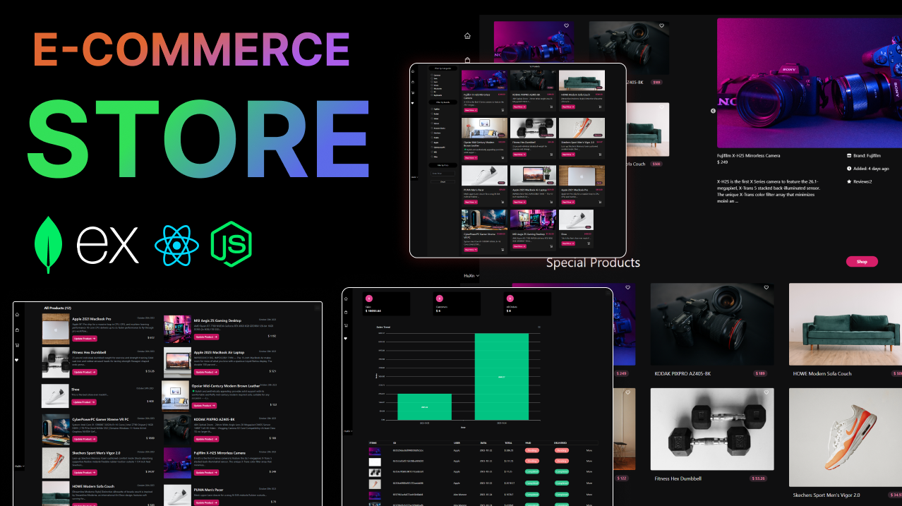

# 🛍️ Shopnest

Shopnest ek **MERN Stack E-Commerce Store** hai — ek full-stack online shopping platform jisme users products browse kar sakte hain, cart me add kar sakte hain, aur checkout process complete kar sakte hain. Backend Node.js/Express/MongoDB pe bana hai aur frontend React (Vite) pe.

## 📸 Preview



## 🚀 Tech Stack

**Backend**
- Node.js + Express.js
- MongoDB + Mongoose
- JWT (jsonwebtoken) — authentication
- bcryptjs — password hashing
- multer / express-formidable — file uploads
- cookie-parser, cors, dotenv

**Frontend**
- React (Vite)

**Dev tools**
- nodemon, concurrently

## 📁 Project Structure

```
Shopnest/
   backend/          # Express API, models, routes, controllers
   frontend/          # React client app
   example-env.env   # Sample environment variables
   package.json      # Root scripts (runs backend + frontend together)
   thumb.png         # Project thumbnail
```

## ⚙️ Getting Started

### Prerequisites
- Node.js installed
- MongoDB (local ya Atlas) running

### Installation

1. Repo clone karo:
   ```bash
   git clone https://github.com/nishayadav6969me-a11y/Shopnest.git
   cd Shopnest
   ```

2. Root, backend aur frontend me dependencies install karo:
   ```bash
   npm install
   cd backend && npm install
   cd ../frontend && npm install
   cd ..
   ```

3. `example-env.env` ko copy karke `backend` folder me `.env` banao aur values apne hisaab se set karo:
   ```env
   PORT=5000
   MONGO_URI='mongodb://127.0.0.1:27017/huxnStore'
   JWT_SECRET=your_jwt_secret_here
   ```

### Running the app

Root directory se ye command chalao — ye backend aur frontend dono ek saath start kar degi:

```bash
npm run dev
```

Ya alag-alag bhi chala sakte ho:

```bash
npm run backend    # backend server (nodemon)
npm run frontend   # frontend dev server (vite)
```

##  Features

- User authentication (JWT based)
- Product listing & details
- Cart & checkout flow
- Image uploads (multer)
- REST API backend with MongoDB

##  Contributing

Pull requests welcome hain. Kisi bhi major change ke liye pehle issue open karo taaki discuss ho sake.

##  License

ISC
